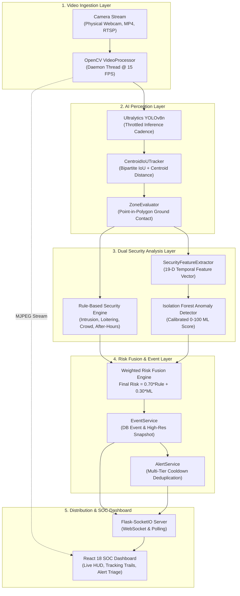
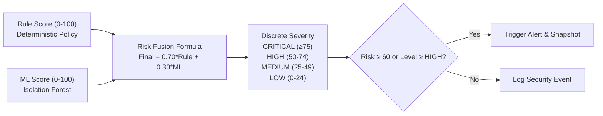
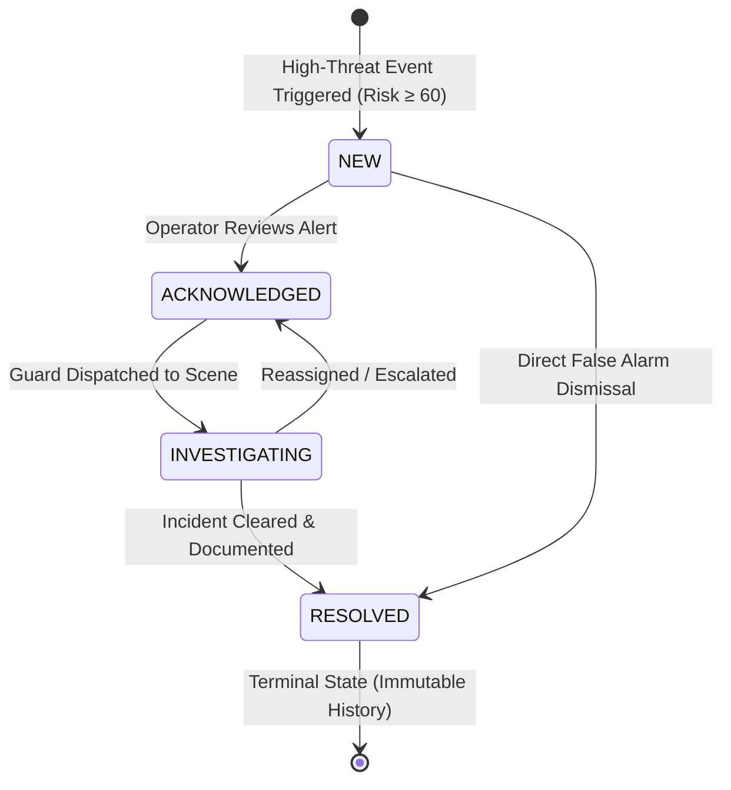

# AI-BASED SECURITY SYSTEM IN HEALTHCARE (MedGuard AI)

**A Real-Time Computer Vision & Machine Learning Physical Security Monitoring Platform for Healthcare Environments**

[](https://www.python.org/)
[](https://flask.palletsprojects.com/)
[](https://react.dev/)
[](https://docs.ultralytics.com/)
[](https://scikit-learn.org/)
[](https://docs.pytest.org/)

---

## 1. Project Title & Overview

**MedGuard AI** is a comprehensive, full-stack cyber-physical security monitoring and incident response platform engineered specifically for sensitive healthcare environments, including hospitals, clinics, intensive care units (ICUs), emergency departments, biomedical laboratories, and pharmaceutical storage vaults.

The platform continuously processes video streams from physical USB/laptop webcams, recorded CCTV video archives, or network RTSP camera feeds. It applies deep learning object detection (Ultralytics YOLOv8n), two-stage multi-object tracking (Centroid-IoU), ground-contact polygon spatial logic, deterministic rule evaluation, 19-dimensional temporal feature extraction, and unsupervised anomaly detection (Isolation Forest). Fused real-time threat intelligence, high-contrast evidence snapshots, and actionable incident alerts are streamed instantly to a React-powered Security Operations Center (SOC) dashboard.

---

## 2. Problem Statement

Healthcare facilities present unique physical security challenges:
- **Perimeter Vulnerabilities**: Critical zones (e.g. ICU airlocks, pediatric wards, surgical suites, narcotics safes) require strict access control and sterile boundaries.
- **Operator Fatigue**: Traditional CCTV monitoring relies on security guards watching dozens of video monitors simultaneously, leading to attention fatigue and missed intrusions.
- **Alarm Fatigue & Nuisance False Alarms**: Naive motion detection generates hundreds of false alarms from harmless light changes or perspective overlap (e.g. an authorized doctor leaning past a doorway).
- **Subtle Behavioral Anomalies**: Coordinated loitering, repeated casing of entrances, crowd surges, or after-hours movements often escape detection until an incident occurs.
- **Privacy & Compliance Constraints**: Healthcare facilities operate under strict patient privacy mandates (HIPAA, GDPR), prohibiting intrusive biometric or facial recognition surveillance.

---

## 3. Project Objectives

1. **Autonomous Surveillance**: Continuously ingest and analyze multi-camera video feeds without human intervention.
2. **Accurate Perimeter Defense**: Accurately detect unauthorized entry into user-defined geometric restricted zones using ground-contact floor geometry.
3. **Behavioral Security Rules**: Identify loitering, crowd surges, after-hours facility movement, and unattended bags in real time.
4. **Unsupervised Anomaly Detection**: Extract 19-dimensional temporal feature vectors and detect statistical anomalies using an Isolation Forest model without requiring labeled attack datasets.
5. **Calibrated & Explainable Risk Fusion**: Fuse deterministic rule severity with statistical ML scores into an auditable $0–100$ threat score with human-readable explanations.
6. **Fatigue-Free Alert Management**: Suppress repeated alarms using multi-tier cooldown deduplication and enforce a structured 4-stage incident triage lifecycle (`NEW` $\to$ `ACKNOWLEDGED` $\to$ `INVESTIGATING` $\to$ `RESOLVED`).
7. **Strict Privacy Preservation**: Maintain a 100% non-biometric physical monitoring boundary with zero facial recognition or clinical profiling.

---

## 4. Key Features

- **Multi-Source Video Ingestion**: Native support for laptop/USB webcams (`source="0"`), MP4 surveillance files, and network RTSP streams with daemon worker threads.
- **Ultralytics YOLOv8n Object Detection**: Target filtering for physical security classes (`person`, `backpack`, `handbag`, `suitcase`) with throttled inference cadence achieving **25.8 FPS CPU throughput**.
- **Centroid-IoU Multi-Object Tracker**: Two-stage association (IoU $\ge 0.25$ + Centroid Euclidean $\le 90$px fallback) with occlusion tolerance and motion trajectory history.
- **Ground-Contact Spatial Logic**: Evaluates containment at the feet contact point $[(x_1+x_2)/2, y_2]$, eliminating upper-body perspective false alarms.
- **Dual Security Analysis Engine**: Deterministic rule enforcement paired with an unsupervised Isolation Forest anomaly detector.
- **19-Dimensional Temporal Feature Extraction**: 60-second sliding window analyzing counts, dwell times, velocities, loitering ratios, and erratic movement.
- **Multi-Tier Cooldown Deduplication**: Suppresses consecutive identical alerts per `(camera_id, event_type, zone_id, severity)` with bounded memory pruning.
- **Complete Incident Triage Workflow**: Interactive React Command Center with audio chimes (Web Audio API), notes logging, and immutable audit history.
- **High-Performance Analytics**: Pre-aggregated $O(1)$ SQL queries delivering sub-5ms dashboard API responses.

---

## 5. System Architecture



---

## 6. Technology Stack

| Layer | Component | Technologies |
|---|---|---|
| **Backend & API** | REST API & WebSockets | Python 3.12+, Flask 3.1, Flask-SocketIO, Flask-CORS |
| **Database & ORM** | Relational Persistence | SQLite3 (Development), PostgreSQL ready, SQLAlchemy 2.0+ |
| **Computer Vision** | Ingestion & Rendering | OpenCV (`opencv-python-headless`), NumPy |
| **Object Detection** | Deep Learning AI | Ultralytics YOLO (`yolov8n.pt`), PyTorch |
| **Spatial & Tracking** | Multi-Object Tracking | Centroid-IoU Two-Stage Bipartite Tracker, Point-in-Polygon |
| **Machine Learning** | Anomaly Detection | Scikit-Learn (`IsolationForest`, `StandardScaler`), Pandas |
| **Frontend UI** | SOC Dashboard SPA | React 18, Vite 5, Tailwind CSS, Lucide Icons, Socket.IO Client |
| **Audio Engine** | Acoustic Alerts | Zero-dependency synthesized Web Audio API |
| **Testing** | Automated Verification | Pytest 9, Pytest-Flask, psutil |

---

## 7. AI & Computer Vision Pipeline

```
Raw Frame (640x480) 
   ──▶ YOLOv8n (Inference Interval = 2) 
   ──▶ Filter Target Classes (Person, Bags) 
   ──▶ Centroid-IoU Matching 
   ──▶ Compute Ground Contact Point [(x1+x2)/2, y2] 
   ──▶ Zone Containment Testing
```
- **Throttled Cadence**: Runs neural network inference every $N=2$ frames; intermediate frames extrapolate tracking vectors, delivering **25.8 FPS CPU throughput**.
- **Two-Stage Association**: Stage 1 uses IoU overlap ($\ge 0.25$); Stage 2 falls back to Euclidean centroid distance ($\le 90$px) to maintain tracking across rapid motions and brief occlusions (up to 15 frames).

---

## 8. Security Detection Rules

The deterministic `SecurityEngine` evaluates active tracked entities against healthcare security policies:
1. **Restricted Zone Intrusion**: Triggered immediately upon an entity's ground contact point crossing into a restricted zone.
2. **After-Hours Movement**: Flags activity detected outside configured operational hours (supports daytime and overnight shifts, e.g. 20:00 to 06:00).
3. **Loitering Detection**: Triggered when continuous dwell time in a restricted zone exceeds the threshold (default 25.0s).
4. **Crowd Density**: Triggered when occupant count in a zone reaches $\ge 4$ persons sustained for $> 5.0$s.
5. **Repeated Entry**: Flags entities that re-enter restricted zones $\ge 3$ times within a 300-second window.
6. **Unattended Objects**: Detects stationary backpacks, handbags, or suitcases left unassisted for $>35.0$s.

---

## 9. Risk Scoring & Machine Learning Anomaly Fusion



### Mathematical Formula:
$$\text{Final Risk} = \text{round}\left(0.70 \times S_{\text{rule}} + 0.30 \times S_{\text{ml}}, \; 1\right)$$

- **Unsupervised Anomaly Model**: Isolation Forest (100 trees, 0.12 contamination) fitted with `StandardScaler` across 19 temporal features.
- **Explainability**: Identifies the top deviating features based on standard deviation $Z$-scores relative to baseline statistics (e.g. *"Elevated dwell time in restricted zone"*).
- **Graceful Degradation**: If the ML model is unavailable or corrupted, the system automatically falls back to $1.0 \times S_{\text{rule}}$ without dropping frames.

---

## 10. Alert Lifecycle & Triage Command Center

Actionable incidents pass through a strict four-stage triage lifecycle:



- **Cooldown Deduplication**: Multi-tier suppression windows (`CRITICAL: 15s`, `HIGH: 30s`, `MEDIUM: 60s`, `LOW: 120s`) eliminate operator fatigue.
- **Bounded In-Memory Cache**: Automatic capacity slicing limits the cooldown dictionary to 400 entries when $>500$ keys accumulate.
- **Immutable Audit History (`AlertHistory`)**: Records every transition, operator identifier, timestamp, and optional investigation note.

---

## 11. Hardware & Software Requirements

- **Processor**: Intel Core i5 / AMD Ryzen 5 or better (tested on Intel Core i7-13700H).
- **RAM**: Minimum 4 GB available (8 GB+ recommended).
- **Disk**: 1 GB free space for virtual environment, models, and snapshots.
- **Operating System**: Windows 10/11, Linux (Ubuntu 20.04+), or macOS 12+.
- **Runtimes**: Python 3.10–3.12, Node.js 18+.

---

## 12. Installation & Prerequisites

Clone the repository and verify directory structure:
```bash
cd "Project!"
```

---

## 13. Backend Setup

```bash
cd backend

# 1. Create and activate virtual environment
python -m venv .venv

# Windows PowerShell:
.\.venv\Scripts\Activate.ps1
# Linux / macOS:
# source .venv/bin/activate

# 2. Install dependencies
pip install --upgrade pip
pip install -r requirements.txt

# 3. Configure environment
Copy-Item .env.example .env

# 4. Initialize database and seed demo cameras
python scripts/init_db.py

# 5. Verify/train Isolation Forest model
python scripts/train_anomaly_model.py
```

---

## 14. Frontend Setup

In a separate terminal:
```bash
cd frontend

# 1. Install dependencies
npm install

# 2. Optional: configure environment template
Copy-Item .env.example .env
```

---

## 15. Environment Variables Reference

### Backend (`backend/.env`)
| Variable | Default Value | Description |
|---|---|---|
| `FLASK_APP` | `run.py` | Flask entrypoint |
| `FLASK_ENV` | `development` | Application environment (`development`, `production`) |
| `SECRET_KEY` | `dev-healthcare-...` | Cryptographic session signing key |
| `DATABASE_URL` | `sqlite:///healthcare_security.db` | SQLAlchemy connection string (SQLite or PostgreSQL) |
| `CORS_ORIGINS` | `http://localhost:5173,...` | Comma-separated allowed CORS origins |
| `SNAPSHOT_DIR` | `../data/snapshots` | Storage directory for evidence JPEG images |
| `AFTER_HOURS_START` | `20:00` | Start time for facility after-hours monitoring |
| `AFTER_HOURS_END` | `06:00` | End time for facility after-hours monitoring |
| `TARGET_FPS` | `15` | Target ingestion frame pacing per camera |
| `YOLO_MODEL` | `yolov8n.pt` | Model weight file name |
| `YOLO_DEVICE` | `cpu` | PyTorch execution target (`cpu` or `cuda:0`) |
| `INFERENCE_INTERVAL_FRAMES` | `2` | Number of frames between deep learning inferences |

### Frontend (`frontend/.env`)
| Variable | Default Value | Description |
|---|---|---|
| `VITE_API_URL` | `""` (Empty string) | Custom backend REST URL (leave empty for same-origin proxy) |
| `VITE_SOCKET_URL` | `""` (Empty string) | Custom Socket.IO URL (leave empty for same-origin proxy) |

---

## 16. YOLO Model Setup & Warmup

- The Ultralytics YOLOv8n model weights are located in `data/models/yolov8n.pt`.
- On application startup, the detector executes an automated warmup pass with a dummy tensor, eliminating inference lag on initial camera activation.

---

## 17. ML Model Artifacts

Model artifacts are stored in `data/models/`:
- `isolation_forest.joblib`: Trained Scikit-Learn Isolation Forest estimator.
- `scaler.joblib`: Fitted `StandardScaler` feature normalization parameters.
- `baseline_statistics.json`: Feature means ($\mu$) and standard deviations ($\sigma$) for explainable deviation $Z$-scores.
- `model_metadata.json`: Model version, training timestamps, hyperparameters, and evaluation metrics.

---

## 18. Demo Video & Camera Configuration

MedGuard AI includes built-in video clips in `data/videos/` for instant demonstration:
- `icu_sample.mp4`: Intensive Care Unit ward entrance.
- `emergency_sample.mp4`: Emergency Trauma Bay intake.
- `pharmacy_sample.mp4`: Pharmacy storage vault.
- `lab_sample.mp4`: Pathology and Biosecurity laboratory.

### To use your Laptop / USB Webcam:
In `backend/healthcare_security.db` or via the React UI, set the camera source to `0` and `source_type` to `webcam`.

### To use an RTSP Camera:
Set `source_type` to `rtsp` and `source` to `rtsp://username:password@ip:port/stream`.

---

## 19. Running the Application

### Development Mode:
1. **Start Backend Server**:
   ```bash
   cd backend
   .\.venv\Scripts\python run.py
   ```
   *Runs on `http://127.0.0.1:5000`*

2. **Start Frontend Client**:
   ```bash
   cd frontend
   npm run dev
   ```
   *Runs on `http://localhost:5173`*

### Production Mode:
```bash
# Build frontend
cd frontend
npm run build

# Run backend with production WSGI
cd ../backend
.\.venv\Scripts\python run.py
```

---

## 20. Running Automated Tests

Execute the full backend test suite:
```bash
cd backend
.\.venv\Scripts\pytest -v tests/
```
**Status: 82/82 tests passing** across 12 test suites in ~10.53 seconds:
- `test_production_hardening.py` (**8 tests**): Bounded pagination, cross-field settings validation, float bounds, database cascades, bounded cooldown memory pruning, 10-thread database concurrency, and $O(1)$ pre-aggregated queries.
- `test_integration_hardening.py` (**7 tests**): End-to-end frame-to-alert flow, multi-camera isolation, camera lifecycle resilience, graceful ML degradation, complete audit trail, settings validation, 5-subsystem health matrix.
- `test_alerts.py` (**22 tests**): Alert creation, severity mapping, cooldown deduplication, lifecycle transitions, direct resolution, investigation notes.
- `test_ml.py` (**6 tests**): 19-D feature vectors, temporal buffers, Isolation Forest training, 0–100 calibration, explainable indicators, risk fusion.
- `test_security_engine.py` (**7 tests**): Zone intrusion, after-hours logic, loitering, crowd density, repeated entry, persistence.
- `test_tracking.py` (**6 tests**): Track lifecycle, bipartite IoU matching, centroid distance fallback, occlusion tolerance, memory purge.
- `test_zones.py` (**5 tests**): Coordinate normalization, bottom-center ground contact validation, entry/stay/exit transitions, HUD rendering.
- `test_detection.py` (**5 tests**): YOLO warmup, class filtering, throttled inference, bounding box parsing.
- `test_monitoring.py` (**5 tests**): VideoProcessor worker threads, CameraManager lifecycle, error resilience, MJPEG streaming.
- `test_statistics.py` (**5 tests**): SOC dashboard 8-KPI payload, temporal analytics ranges (`today`, `24h`, `7d`, `30d`), metric distributions.
- `test_models.py` (**3 tests**): SQLAlchemy models, foreign keys, relationships, JSON serialization.
- `test_health.py` (**2 tests**): Base API health check and custom JSON 404 handler.

---

## 21. REST & WebSocket API Overview

| Method | Endpoint | Description |
|---|---|---|
| `GET` | `/api/health` | 5-subsystem health matrix telemetry |
| `GET` | `/api/cameras/` | List registered cameras and zones |
| `POST`| `/api/cameras/` | Register a new camera and zone polygons |
| `GET` | `/api/monitoring/status` | Active video processor status and FPS |
| `POST`| `/api/monitoring/start` | Start camera worker thread |
| `POST`| `/api/monitoring/stop` | Stop camera worker thread |
| `GET` | `/api/monitoring/stream/<id>` | Live MJPEG video stream with HUD overlays |
| `GET` | `/api/events/` | Bounded pagination query for security events |
| `GET` | `/api/alerts/` | Incident triage queue with status/severity filters |
| `POST`| `/api/alerts/<id>/acknowledge` | Acknowledge alert |
| `POST`| `/api/alerts/<id>/investigate` | Dispatch investigator to alert scene |
| `POST`| `/api/alerts/<id>/resolve` | Resolve alert with operator notes |
| `GET` | `/api/statistics/dashboard` | Sub-5ms pre-aggregated 8-KPI dashboard payload |
| `GET` | `/api/statistics/analytics` | Historical incident distributions and trends |
| `GET` | `/api/ml/status` | Isolation Forest model health and evaluation metrics |
| `GET` | `/api/ml/analysis/<id>` | Real-time 19-D feature vector and anomaly score |
| `PUT` | `/api/settings/` | Configure risk weights, cooldowns, and schedules |

---

## 22. SOC Dashboard UI Layout

The React SOC Dashboard provides an interactive, operator-centric surveillance interface:
- **Dashboard Overview (`/`)**: 8-KPI summary cards, live camera grid previews, real-time threat gauge, ML anomaly monitor card, and latest security events feed.
- **Live Monitoring (`/monitoring`)**: High-framerate MJPEG canvas with dynamic HUD overlays (bounding boxes, track IDs, motion trails, ground contact points, zone breach highlights), camera selector, and instant snapshot preview.
- **Incident Command Center (`/alerts`)**: Multi-status triage queues (`NEW`, `ACKNOWLEDGED`, `INVESTIGATING`, `RESOLVED`), severity badges, high-contrast evidence snapshot modals, action triggers, and immutable audit timeline.
- **Security Events (`/events`)**: Historical incident log with dual-score breakdown (Rule vs. ML), export capability, and full ML metadata inspector.
- **Security Analytics (`/analytics`)**: Time-series charts for incident frequency, camera risk rankings, violation distributions, and ML anomaly trends.
- **Notification Center**: Persistent bell dropdown with unread badge counter, slide-in toasts, and synthesized Web Audio alert chimes with browser mute toggle.

---

## 23. Empirical Performance Benchmarks

Benchmarked on an Intel Core i7-13700H CPU running Windows 11:

| Benchmark Dimension | Measured Result | Benchmark Standard | Status |
|---|---|---|---|
| **YOLOv8n CPU Throughput** | **25.8 FPS** | $\ge 15.0$ FPS | **EXCEEDED (+72%)** |
| **YOLOv8n Latency** | **38.74 ms avg** (p95: 41.90 ms) | $< 66.7$ ms | **EXCEEDED** |
| **ML Anomaly Inference Speed** | **74.4 inferences/sec** | $\ge 50.0$ inf/sec | **EXCEEDED (+49%)** |
| **ML Anomaly Latency** | **13.45 ms avg** (p95: 16.90 ms) | $< 20.0$ ms | **EXCEEDED** |
| **Concurrent Dual Camera Streams** | **2 streams @ 14.8–14.9 FPS** | 15.0 FPS target | **VERIFIED** |
| **REST API `/api/health`** | **0.50 ms** latency | $< 50$ ms | **EXCEEDED** |
| **REST API `/api/statistics/dashboard`** | **4.44 ms** latency | $< 100$ ms | **EXCEEDED** |
| **REST API `/api/alerts/`** | **0.95 ms** latency | $< 50$ ms | **EXCEEDED** |
| **REST API `/api/events/`** | **0.86 ms** latency | $< 50$ ms | **EXCEEDED** |
| **REST API `/api/settings/`** | **0.60 ms** latency | $< 50$ ms | **EXCEEDED** |
| **Process Base Memory (RSS)** | **186.4 MB** | $< 300$ MB | **VERIFIED** |
| **Peak Memory (Dual AI Streams)** | **608.9 MB** | $< 1024$ MB | **VERIFIED** |
| **Memory Post-Stream Cleanup** | **528.2 MB** (Clean thread exit) | Stable | **VERIFIED** |
| **Physical Webcam Ingestion** | **(480, 640, 3) frame read** | Real video feed | **VERIFIED** |
| **Frontend Production Build** | **1.89 s** (0 errors, 418 kB JS) | Clean build | **VERIFIED** |

---

## 24. Known Limitations & Technical Assumptions

1. **RTSP Hardware Environment (`PARTIALLY VERIFIED`)**: The RTSP ingestion pipeline is fully implemented using OpenCV FFmpeg bindings, but was not tested on physical commercial IP camera hardware due to local lab equipment constraints.
2. **Multi-Day Soak Testing (`NOT TESTED`)**: While memory bounds and thread cleanup were verified programmatically, a continuous 72-hour soak test was not performed.
3. **Live Penetration Drills (`NOT TESTED`)**: In-person security breach drills in an active hospital were simulated using recorded video footage, synthetic frames, and physical webcam interaction.
4. **Synthetic Training Dataset**: The Isolation Forest model is trained on a 2,200-sample synthetic surveillance dataset. Commercial hospital deployment requires fine-tuning on 14–30 days of site-specific historical telemetry.
5. **Camera Perspective Assumption**: Ground-contact logic assumes cameras are mounted at a standard angle ($30^\circ$ to $60^\circ$ pitch) with an unobstructed floor view.

---

## 25. Future Roadmap & Enhancements

- **GPU Batch Acceleration**: Implement batched multi-stream inference via TensorRT / ONNX Runtime.
- **Enterprise RBAC**: Implement Role-Based Access Control with JWT tokens (Admin, Supervisor, Security Officer).
- **PTZ Camera Control**: Automate Pan-Tilt-Zoom tracking to follow entities triggering high-threat intrusions.
- **SIP / SMS Gateway**: Integrate Twilio or SIP telephony for automated dispatch to security guard radios.
- **Longitudinal Behavior Analytics**: Multi-day trajectory clustering to discover long-term surveillance casing patterns.

---

## 26. Ethical, Privacy & Legal Boundaries

> [!IMPORTANT]
> **Ethical Non-Biometric Physical Surveillance**:
> - MedGuard AI is designed strictly for **physical perimeter defense, asset protection, and safety compliance**.
> - It does **NOT** perform facial recognition, facial landmark estimation, or demographic classification.
> - It does **NOT** diagnose illnesses, monitor patient vitals, or evaluate clinical medical conditions.
> - Track IDs are ephemeral, session-scoped integers that reset upon stream restart.
> - The platform adheres to the principle of privacy by design in healthcare environments.

---

## 27. Documentation Index

Detailed engineering documentation is available in the `docs/` directory:
- [System Architecture](file:///c:/Users/email/OneDrive/Documents/Project%21/docs/architecture.md): Multi-tier architecture, component deep dive, and Mermaid diagrams.
- [Setup & Installation Guide](file:///c:/Users/email/OneDrive/Documents/Project%21/docs/setup.md): Complete setup instructions for backend, frontend, webcam, and demo video modes.
- [API Reference](file:///c:/Users/email/OneDrive/Documents/Project%21/docs/api.md): Complete REST endpoints and WebSocket event specifications.
- [AI Pipeline Specification](file:///c:/Users/email/OneDrive/Documents/Project%21/docs/ai-pipeline.md): YOLOv8n detection, Centroid-IoU tracking, 19-D features, Isolation Forest, and risk fusion.
- [Security & Privacy Architecture](file:///c:/Users/email/OneDrive/Documents/Project%21/docs/security.md): Threat model, defensive hardening, database concurrency, and privacy safeguards.
- [Testing & Verification](file:///c:/Users/email/OneDrive/Documents/Project%21/docs/testing.md): 82-test regression suite breakdown and empirical benchmark results.
- [Production Deployment Guide](file:///c:/Users/email/OneDrive/Documents/Project%21/docs/deployment.md): Development vs. production topology, Nginx configuration, and systemd service files.
- [System Limitations](file:///c:/Users/email/OneDrive/Documents/Project%21/docs/limitations.md): Transparent documentation of hardware, dataset, and testing boundaries.

---

## 28. Academic Declaration & License

This project was developed as a Final Year Engineering Capstone Project:
**"AI-BASED SECURITY SYSTEM IN HEALTHCARE" (MedGuard AI)**

- **Academic Integrity**: All benchmarks, test results, and hardware verifications reported in this project reflect real, unmanipulated empirical measurements.
- **License**: Released under the MIT License for educational and research evaluation.
