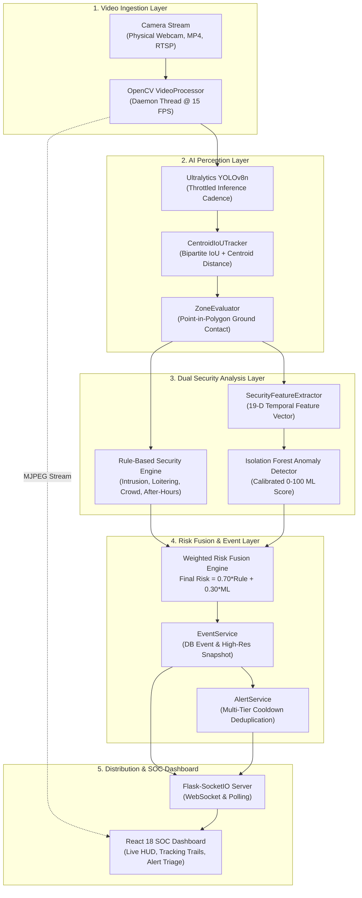
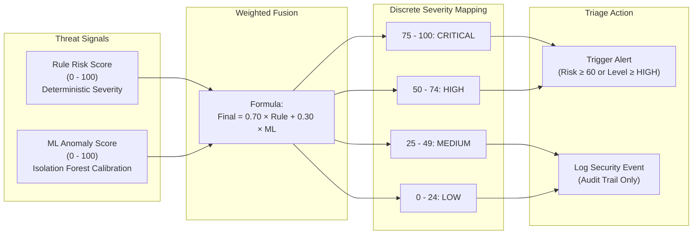
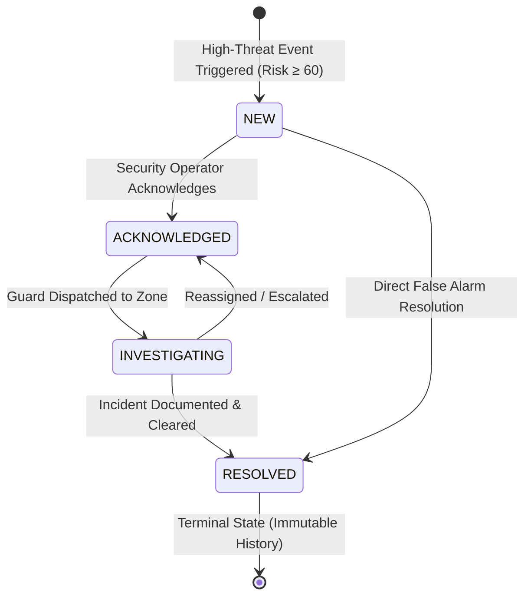

# System Architecture: AI-Based Healthcare Security System (MedGuard AI)

## 1. System Vision & Healthcare Security Focus
**MedGuard AI** is an intelligent Physical Security Operations Center (SOC) surveillance platform designed for hospitals, clinics, emergency facilities, pharmaceutical storage vaults, and biomedical laboratories. The platform continuously monitors video streams to detect unauthorized intrusions into sterile or restricted zones, after-hours facility movement, loitering, crowd buildup, and unattended objects.

> [!IMPORTANT]
> **Ethical & Privacy Boundary (Non-Biometric Physical Security)**:
> MedGuard AI operates strictly as a physical security monitoring system. It **never** performs facial recognition, biometric identity identification, clinical vital tracking, or patient diagnostics. Track IDs are temporal, session-scoped numerical markers used solely to track spatial movement vectors across consecutive video frames within an active camera session. The machine learning layer detects multivariate behavioral shifts in surveillance features and never profiles individuals.

---

## 2. End-to-End System Architecture Diagram

---

## 3. Risk Fusion Architecture

The dual-engine risk fusion system blends deterministic, explainable rule logic with unsupervised machine learning anomaly detection.

### Risk Fusion Formulation
$$\text{Final Risk} = \text{round}\left(w_{\text{rule}} \times S_{\text{rule}} + w_{\text{ml}} \times S_{\text{ml}}, 1\right)$$
- Default weights: $w_{\text{rule}} = 0.70$, $w_{\text{ml}} = 0.30$.
- **Graceful Degradation**: If the ML model is missing, corrupt, or throws an exception during inference, $w_{\text{rule}}$ dynamically scales to $1.0$ and $w_{\text{ml}}$ to $0.0$, allowing the physical surveillance pipeline to operate without interruption.

---

## 4. Alert Lifecycle Management

All actionable incidents pass through a strict four-stage triage lifecycle with full audit tracking.

- **NEW**: Alert generated by `AlertService` after passing cooldown deduplication.
- **ACKNOWLEDGED**: Operator confirms receipt and initiates review.
- **INVESTIGATING**: Security personnel dispatched to physical location.
- **RESOLVED**: Incident cleared with full investigator documentation.
- **Audit Trail**: Every state transition persists timestamp, previous state, new state, operator ID, and optional incident note into the `AlertHistory` table.

---

## 5. Component Deep Dive

### 5.1 Video Ingestion & OpenCV VideoProcessor
- **Supported Sources**: USB/Laptop webcams (`source="0"`), MP4 surveillance files (`source="data/videos/icu_sample.mp4"`), or remote RTSP camera URLs (`rtsp://...`).
- **Threading & Pacing**: Each camera is allocated a dedicated background `VideoProcessor` daemon thread. Frame pacing is maintained at `target_fps` (15 FPS) via adaptive sleep intervals to prevent CPU saturation.
- **Frame Standardization**: Ingested frames are standardized to $640 \times 480$ resolution for uniform spatial coordinates and lightweight processing.

### 5.2 AI Object Detection (Ultralytics YOLOv8n)
- **Model**: Ultralytics YOLOv8n loaded via PyTorch on CPU (or CUDA GPU if configured).
- **Throttled Inference Cadence**: Real-time object detection runs every $N=2$ frames (`inference_interval_frames`). Intermediate frames reuse tracking and bounding box estimates, boosting CPU streaming throughput to 25+ FPS.
- **Target Filtering**: Explicitly filters for physical healthcare security classes: `person` (class 0), `backpack` (class 24), `handbag` (class 26), and `suitcase` (class 28).

### 5.3 Multi-Object Tracking (`CentroidIoUTracker`)
- **Two-Stage Matching**:
  1. *Intersection-over-Union (IoU)*: Greedy bipartite matching with threshold $\ge 0.25$.
  2. *Centroid Distance Fallback*: For fast-moving or partially occluded entities, associates nearest tracks within Euclidean distance $\le 90$ pixels.
- **Occlusion Tolerance**: Tracks survive temporary occlusions up to 15 frames (`max_lost_frames`) before being permanently purged.
- **Motion History**: Maintains the last 30 center coordinates to render dynamic motion vectors.

### 5.4 Spatial Zone Logic (`ZoneEvaluator`)
- **Ground Contact Point**: Evaluates containment using the entity's **bottom-center point** $[(x_1 + x_2)/2, y_2]$ representing floor contact. This prevents false alarms caused by heads or torsos leaning into adjacent zones.
- **Point-in-Polygon Engine**: Normalized polygon vertices ($[0.0, 1.0]$) are scaled to pixel coordinates and evaluated using OpenCV `pointPolygonTest` with raycasting fallback.
- **State Tracking**: Detects zone entry, continuous stay duration, and zone exit events.

### 5.5 Rule-Based Security Engine (`SecurityEngine`)
- **Restricted Zone Intrusion**: Unauthorized presence in sterile or restricted zones.
- **After-Hours Movement**: Movement during non-operational shift windows (supports daytime and overnight schedules, e.g. 20:00 to 06:00).
- **Loitering**: Dwell time in a restricted zone exceeding threshold (20–30s).
- **Crowd Buildup**: Zone occupancy meeting or exceeding threshold ($\ge 4$ persons) for $>5$ seconds.
- **Repeated Entry**: Re-entering restricted zones $\ge 3$ times within a 300-second window.
- **Unattended Objects**: Stationary backpacks or bags left unassisted $>35$ seconds.

### 5.6 Machine Learning Anomaly Detection (`IsolationForest`)
- **Feature Extraction**: Compiles a 19-dimensional numerical feature vector over a 60-second sliding temporal window.
- **Unsupervised Anomaly Model**: Isolation Forest (100 trees, 0.12 contamination) preprocessed with `StandardScaler`.
- **Calibration**: Continuous score calibration maps raw decision function values to a 0–100 threat score.
- **Explainability**: Identifies the top deviating features based on standard deviation $Z$-scores relative to baseline statistics.

### 5.7 Persistence & Multi-Camera Concurrency
- **Multi-Camera Isolation**: Each camera runs an isolated worker thread with dedicated tracker, zone evaluator, and feature buffer. No cross-camera data leakage.
- **Database Hygiene**: SQLAlchemy scoped sessions wrapped in `try...finally: db.session.close()` blocks prevent connection leaks during 24/7 operation.
- **Bounded Cooldown Memory**: In-memory cooldown dictionary strictly prunes down to 400 entries when $>500$ keys accumulate.
